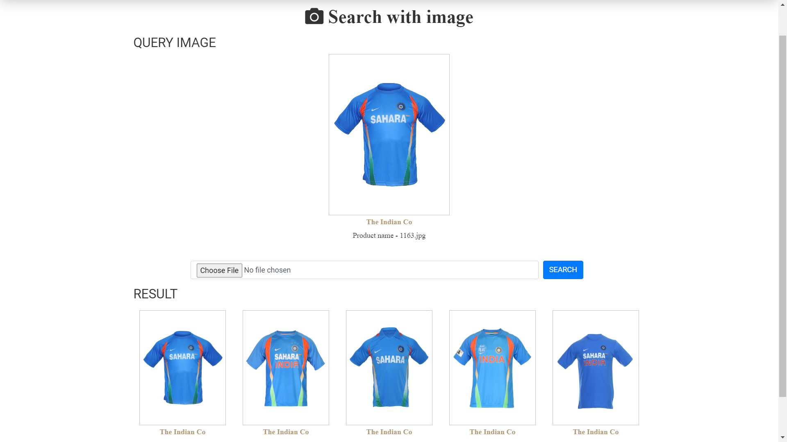

<h1 align="center"> Reverse Image Search Engine 📸->🖼️->🔎 </h1>
<p align="center">The Reverse Image Search Engine allows users to find visually similar images based on an input image.</p>
<br>

## 🔦 Preview


## 🚀 Features
- **Reverse Image Search:** Utilizing advanced image recognition algorithms, this search engine allows users to upload an image and find visually similar images.
- **Web-based Interface:** The user-friendly web interface enables easy interaction with the search engine, making it accessible to users of all technical backgrounds.
- **Flexible Search Options:** Users can choose to search for similar images either from a predefined dataset or across the entire web, depending on their requirements.

## 🛠️ Installation and Usage

**1. Clone the repository:**

```bash
git clone https://github.com/adi-singh2000/Reverse-image-search-engine.git
```
  
**2. Install the required dependecies:**
  
```Bash
pip install -r requirement.txt
```

**3. Obtain the image dataset**

+ Download High Quality Image Dataset

    https://www.kaggle.com/datasets/paramaggarwal/fashion-product-images-dataset
  
+ Download Low Quality Image Dataset

    https://www.kaggle.com/datasets/paramaggarwal/fashion-product-images-small
  
+ Obtain the image dataset from the provided link and place all image data into the "static/images" folder.
  
**4. Execute the program:**
  
```Bash
python Feature_extraction.py
```
  Running the code will generate "embeddings.pkl" and "filenames.pkl" files in the main project folder.
  
**5. Start the application:**

```Bash
python app.py
```
  Access the application through your terminal by clicking on "http://localhost:5000" when executing the above program.

## 👷 Built with
- **Python -** The core programming language used for development.
- **Deep Learning Framework -** Tensorflow
- **ResNet50 Model -** Pre-trained ResNet50 model for image feature extraction.
- **Similarity Calculation Algorithms for small dataset -** KNN aglorithm with euclidean metric
- **Similarity Calculation Algorithms for large dataset -** Annoy algorithm with euclidean metric
- **Flask -** Framework for building the web application and API.
- **HTML/CSS -** Frontend technologies for the user interface.
- **Deployment Tools -** Github & Git

## 📂 Directory Structure
- **Website -** Preview images of the project.
- **static -** Folder containing static assets CSS, uploads, and images.
- **images -** Subfolder within the "static" folder for storing image files.
- **uploads -** Subfolder within the "static" folder for storing uploading files.
- **style.css -** CSS file located within the "static" folder for styling the website.
- **templates -** Folder containing HTML templates for the website's dynamic content.
- **Feature_extraction.py -** Python script responsible for feature extraction.
- **app.py -** Python script connects the frontend with Reverse Image Search Engine model.
- **requirement.txt -** File listing the project's required dependencies.
- **test.py -** Python script for testing.

## 🤔 Challenges
- Feature Extraction: Extracting meaningful and representative features from images to enable accurate image matching.
- Similarity Calculation: Developing algorithms to accurately measure image similarity, considering variations in content, scale, and lighting conditions.
- User Experience and Interface Design: Creating a user-friendly interface for smooth image uploading, search result visualization, and query refinement.
  
## 🥸 Things I Learned
  - Different type of pre-trained CNN model such as (inceptionv3, VGG16 and ResNet50)
  - Working and building of CNN
  - Transfer Learning
  - Creation of Web Application

## 🧑🏻 Author

**Aditya Singh**

- 🌌 [Profile](https://www.linkedin.com/in/aditya-singh-aba7691ba/ "Aditya Singh")


**NOTE:** *This project is only for self learning purpose. It is not suitable for commercial use.*
<p align="center">💙 If you like this project, Give it a ⭐ and Share it with friends!</p>
